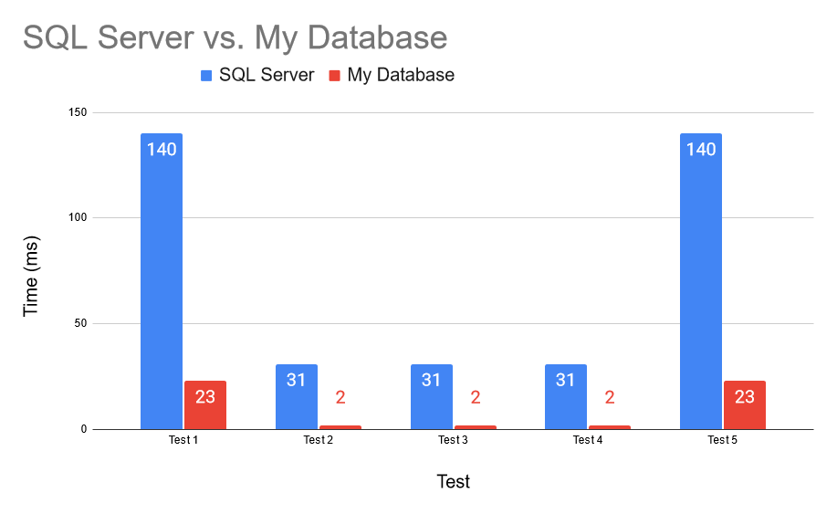

# A_Database_Platform

In my professional career, I have interacted with databases as a user and as an administrator. My interactions with the front-end of these databases have sparked the creation of many questions I have about their back-end functionality:

- How is data stored?
	- What information in addition to the actual data is stored?
	- What is the format and structure of data files?
	- How are encryption and compression used in the storage and retrieval of data?
- How is data retrieved?
	- How is a SQL statement transformed into something with which data can be retrieved? Is it compiled? Is it parsed?
	- How do where clauses work?
	- How do joins work?

In an effort to learn about a database's back-end, I have started this project with the following goals:

1. Plan and implement a rough draft of how I think a database works including only the minimum functionality of table creation, data insertion, data updation, data deletion, and data selection
2. Use tests to ensure the program's reliability and to compare its performance against a known and trusted database
3. Use the results of the tests to consider a different program implementation and/or data file structure. Repeat implementation and testing as necessary until results are satisfactory.

This project is a learning experience. I have some ideas about how a database might work, so I am taking a stab in the dark, learning what works and what doesn't, all in the hopes that I can get close to the performance of a database like Oracle or SQL Server. 

# Planned Features
## Phase 1
- Table creation
- Data insertion
- Data updation
- Data deletion
- Data selection

## Phase 1 Performance Comparison

##  Phase 1 Test Queries:

For Phase 1, I found a data set online for alcohol licenses and used a subset of 1000 rows to test the features included in this phase as outlined above. The table has 7 columns containing data in string, integer, and date forms.

1. select * from alc_brands;
	- Returns 1000 rows
2. select * from alc_brands where BRAND-NAME = 'INCARNADINE 19 VIOGNIER-PINOT GRIGIO PASO ROBLES';
	- Returns 1 row
3. select * from alc_brands where BRAND-NAME = 'INCARNADINE 19 VIOGNIER-PINOT GRIGIO PASO ROBLES' and EFFECTIVE = '3/13/2020';
	- Returns 1 row
4. select * from alc_brands where BRAND-NAME = 'INCARNADINE 19 VIOGNIER-PINOT GRIGIO PASO ROBLES' and EFFECTIVE = '3/13/2020' and CT-REGISTRATION-NUMBER = 165213 and STATUS = 'ACTIVE' and EXPIRATION = '3/12/2023' and OUT-OF-STATE-SHIPPER = 'PENROSE HILL LIMITED' and SUPERVISOR-CREDENTIAL = 'LSL.0001742';
	- Returns 1 row
5. select * from alc_brands where BRAND-NAME = 'INCARNADINE 19 VIOGNIER-PINOT GRIGIO PASO ROBLES' or EFFECTIVE = '7/11/2023' or CT-REGISTRATION-NUMBER = 55578 or STATUS = 'ACTIVE' or EXPIRATION = '12/6/2025' or OUT-OF-STATE-SHIPPER = 'ARTISAN WINES INC' or SUPERVISOR-CREDENTIAL = 'LSL.0001471';
	- Returns 1000 rows
	
##  Phase 1 Thoughts

Comparing the times for my database and SQL Server, I am surprised at how quick my database appears to be. However, there is no server connection or API calls in my program, just an executable. Nevertheless, I am happy with my database's performance at this point and I consider this phase to be done. The real comparison comes when I make a server and API for my database.

## Phase 2
- Server setup
	- HTML and Javascript front-end with calls to the back-end C drivers for data retrieval and manipulation

##  Phase 2 Thoughts

I have successfully created an API and a Website which can connect to the API. However there are a few issues. 

First, my internet service provider has restricted devices outside of my home network from connecting to my computer, so while I could run a server at my house, none of you would be able to connect. 

Second, at the time of writing, the API is setup to initialize the database everytime a query is run (e.g. examine all datafiles and determine how many tables there are, what their names are, what columns they have, etc.) which is a lot of overhead for one query. I have identified a way to use shared memory to remove this overhead, but that requires a Linux machine which I do not have at the moment. 

So, for the moment, this phase is halfway complete and on hold.

## Phase 3 (In Progress)
- Table selection by groups and aggregate functions
- Table selection with math
- Table selection with "except"
- Table selection using joins
- Table selection with case statements
- Table selection with new columns
- Table selection using "with" to declare views

- Table selection with sorting ("ORDER BY")