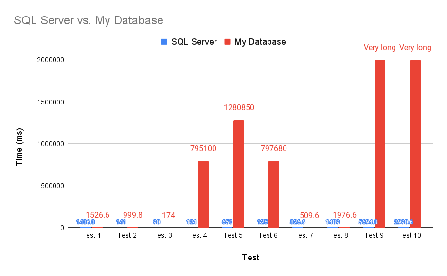

# A_Database_Platform

In my professional career, I have interacted with databases as a user and as an administrator. My interactions with the front-end of these databases have sparked the creation of many questions I have about their back-end functionality:

- How is data stored?
	- What information in addition to the actual data is stored?
	- What is the format and structure of data files?
	- How are encryption and compression used in the storage and retrieval of data?
- How is data retrieved?
	- How is a SQL statement transformed into something with which data can be retrieved? Is it compiled? Is it parsed?
	- How do where clauses work?
	- How do joins work?

In an effort to learn about a database's back-end, I have started this project with the following goals:

1. Plan and implement a rough draft of how I think a database works including only the minimum functionality of table creation, data insertion, data updation, data deletion, and data selection
2. Use tests to ensure the program's reliability and to compare its performance against a known and trusted database
3. Use the results of the tests to consider a different program implementation and/or data file structure. Repeat implementation and testing as necessary until results are satisfactory.

This project is a learning experience. I have some ideas about how a database might work, so I am taking a stab in the dark, learning what works and what doesn't, all in the hopes that I can get close to the performance of a database like Oracle or SQL Server. 

# Planned Features
## Phase 1 (Finished 10/29/2023)
- Table creation
- Data insertion
- Data updation
- Data deletion
- Data selection

## Phase 1 Performance Comparison (10/29/2023)

##  Phase 1 Test Queries (10/29/2023)

For Phase 1, I found a data set online for alcohol licenses and used a subset of 1000 rows to test the features included in this phase as outlined above. The table has 7 columns containing data in string, integer, and date forms.

1. select * from alc_brands;
	- Returns 1000 rows
2. select * from alc_brands where BRAND-NAME = 'INCARNADINE 19 VIOGNIER-PINOT GRIGIO PASO ROBLES';
	- Returns 1 row
3. select * from alc_brands where BRAND-NAME = 'INCARNADINE 19 VIOGNIER-PINOT GRIGIO PASO ROBLES' and EFFECTIVE = '3/13/2020';
	- Returns 1 row
4. select * from alc_brands where BRAND-NAME = 'INCARNADINE 19 VIOGNIER-PINOT GRIGIO PASO ROBLES' and EFFECTIVE = '3/13/2020' and CT-REGISTRATION-NUMBER = 165213 and STATUS = 'ACTIVE' and EXPIRATION = '3/12/2023' and OUT-OF-STATE-SHIPPER = 'PENROSE HILL LIMITED' and SUPERVISOR-CREDENTIAL = 'LSL.0001742';
	- Returns 1 row
5. select * from alc_brands where BRAND-NAME = 'INCARNADINE 19 VIOGNIER-PINOT GRIGIO PASO ROBLES' or EFFECTIVE = '7/11/2023' or CT-REGISTRATION-NUMBER = 55578 or STATUS = 'ACTIVE' or EXPIRATION = '12/6/2025' or OUT-OF-STATE-SHIPPER = 'ARTISAN WINES INC' or SUPERVISOR-CREDENTIAL = 'LSL.0001471';
	- Returns 1000 rows
	
##  Phase 1 Thoughts (10/29/2023)

Comparing the times for my database and SQL Server, I am surprised at how quick my database appears to be. However, there is no server connection or API calls in my program, just an executable. Nevertheless, I am happy with my database's performance at this point and I consider this phase to be done. The real comparison comes when I make a server and API for my database.

## Phase 2 (Finished 11/12/23)
- Server setup
	- HTML and Javascript front-end with calls to the back-end C drivers for data retrieval and manipulation

##  Phase 2 Thoughts (11/12/23)

I have successfully created an API and a Website which can connect to the API. However there are a few issues. 

First, my internet service provider has restricted devices outside of my home network from connecting to my computer, so while I could run a server at my house, none of you would be able to connect. 

Second, at the time of writing, the API is setup to initialize the database everytime a query is run (e.g. examine all datafiles and determine how many tables there are, what their names are, what columns they have, etc.) which is a lot of overhead for one query. I have identified a way to use shared memory to remove this overhead, but that requires a Linux machine which I do not have at the moment. 

So, for the moment, this phase is halfway complete and on hold.

## Phase 3 (In progress, update 5/27/24)
- Table selection by groups and aggregate functions
- Table selection with math
- Table selection with "except"
- Table selection using joins
- Table selection with case statements
- Table selection with new columns
- Table selection using "with" to declare views
- Table selection with sorting ("ORDER BY")
- Table selection with "having" clauses

## Phase 3 Performance Comparison (5/27/24)

##  Phase 3 Test Queries (5/27/24)

For Phase 3, I used the same dataset, but included all 204140 rows. I also created a new data set LIQUOR_SALES_FULL including sale prices and sale quantities. This table has 1327534 rows.

1. select * from LIQUOR_LICENSES_FULL;
	- Returns 204140 rows
2. select * from LIQUOR_LICENSES_FULL where BRAND_NAME = 'FRUIT CLUB';
	- Returns 1 row
3. select MIN(CT_REGISTRATION_NUMBER) MIN from LIQUOR_LICENSES_FULL;
	- Returns 1 row
4. select EXPIRATION, AVG(CT_REGISTRATION_NUMBER) AVG from LIQUOR_LICENSES_FULL group by EXPIRATION;
	- Returns 8640 row
5. select 100 - CT_REGISTRATION_NUMBER as HMM from LIQUOR_LICENSES_FULL;
	- Returns 204140 rows
6. select EXPIRATION, AVG(CT_REGISTRATION_NUMBER) AVG from LIQUOR_LICENSES_FULL group by EXPIRATION having AVG(CT_REGISTRATION_NUMBER) > 150000.0;
	- Returns 625 rows
7. select BRAND_NAME, case when CT_REGISTRATION_NUMBER > 200000 then 'WOW' when CT_REGISTRATION_NUMBER > 100000 then 'ok' else 'yikes'  end NEW_CASE from LIQUOR_LICENSES_FULL;
	- Returns 204140 rows
8. select * from LIQUOR_LICENSES_FULL order by BRAND_NAME asc;
	- Returns 204140 rows
9. select a.BRAND_NAME, b.CT_REGISTRATION_NUMBER from LIQUOR_LICENSES_FULL a join LIQUOR_SALES_FULL b on a.BRAND_NAME = b.BRAND_NAME;
	- Returns 1327534 rows
10. select a.BRAND_NAME, b.CT_REGISTRATION_NUMBER, AVG(b.SALE_PRICE) AVG from LIQUOR_LICENSES_FULL a join LIQUOR_SALES_FULL b on a.CT_REGISTRATION_NUMBER = b.CT_REGISTRATION_NUMBER group by a.BRAND_NAME, b.CT_REGISTRATION_NUMBER;
	- Returns 204140 rows

##  Phase 3 Thoughts (5/27/24)

Functionality on edge cases seems to still be an issue. I will continue to add more tests to the 250+ I already have to eliminate these bugs.

Performance is a big issue. I let the last two test runs for 5 minutes before cancelling them. I believe there are two reasons for such bad performance.
1. In Phase 1, I had used what I call "Frequent Lists," which are lists of all unique values in one column and the row number at which the values could be found. I had a list for every column and for every table. However, these required essentially holding the entire table in memory, which defeats the purpose of a database. So for Phase 3, I removed these and each query goes to get data from the disk instead. This is not nearly as fast as getting data from memory.
2. I do not use multi-threading, which I will start investigating.

# Bugs/ToDo

Known parsing bugs:
- Then values of case statements dont maintain case sensitivity (DONE)
- Cannot reference created columns in where clauses in the same select_node (DONE)
- Cannot give name to created columns or else fails (for ex: "select 'Hi' from alc_brands;") (DONE)
- Stop giving math, func, and case nodes new names and throw error if no name given (DONE)
- Referencing case column from parent select runs into crash error (DONE)
- Parsing math in case then doesnt work (DONE)
	- Also if have mix of math and contants will fail (DONE)
- Cannot do max(count(star)), it does not parse (DONE)
- Parsing where nodes has trouble identifying datatype of created column (DONE)
- Cannot parse function node if appears in math node (DONE)
- Cannot parse function node if appears in case node (DONE)
- Cant use table col in then value (DONE)
- Cant use functions in then values (DONE)
- Fix select a.BRAND_NAME, b.BRAND_NAME (DONE)
- Math node cannot parse col with alias when join (DONE)
- Func node cannot parse col with alias when join (DONE)
- "-1" cant be parsed as a constant (DONE)
- Cannot parse select \*, 1 ONE (DONE)
- Case node fails if not "ELSE" part, needs to be just NULL (DONE)
- Where node cannot parse function with math (DONE)
- Where node cannot parse case statement (DONE)
- Math node cannot parse case statement (DONE)
- Case node cannot parse "then NULL", "else NULL" (DONE)
- Might have trouble parsing empty string (DONE)
- Cant parse case in front of math (DONE)
- Prevent func in on clause (DONE)
- Prevent case in then of case (DONE)
- Prevent funcs in math and case nodes

Non-bug planned parsing improvements:
- Make all columns determine datatype when parsing (DONE)
- Make math nodes be able to contain functions (DONE)
- Make case nodes be able to contain functions (DONE)
- Make count(\*) reference all columns instead of just a char ptr with "\*" (DONE)
- Blanket column names for select * (DONE)
- Having clause references columns if same func node is a column, else make new func node (DONE)
- Blanket column names for select * except (DONE)

Non-bug planned parsing improvements: (MAYBE)
- Make new ptr_type PTR_TYPE_COL_IN_SELECT_BUT_PTR_TO_TABLE_COLS_INFO and use for distinguishing cols from which I can get frequent lists
	- For performance

Known back-end bugs:
- Wheres on created columns dont work (DONE)
- Some where inequalities not implemented yet (DONE)
- Double wheres at two different select_nodes dont work (DONE)
- If take the case of a case, then the col's unique_values_head wont get freed (DONE)
- Do math on a math_node dont work (DONE)
- If take the math of a math, then the col's unique_values_head wont get freed (DONE)
- If comma included in row's data, might be failure (DONE, will either cut off value or throw error cuz mismatching datatypes)
- where BRAND_NAME = BRAND_NAME dont work (DONE)
- Median cant use null values (DONE)
- Case node with no "else" just assign NULL (DONE)
- Cant compare null vs not null (DONE)
- Cant do math on null (DONE)
- Cant do math on case statement (DONE)
- Check to make sure can join on a.BRAND_NAME = 'A CONST STRING' (DONE)
	- This acts as a where on a.BRAND_NAME and then cross joins the remaining rows (DONE)
- Check to make sure can join on 1 = 1 (DONE)
	- This acts as a cross join (DONE)
- Cant do where of case node (DONE)
- Cant do join on case node (DONE)
- Fails when select zero a cols but join a on b (DONE)

Non-bug planned back-end improvements:
- Improve malloc and free to O(1) operations (DONE)
- Prevent dashes in column names (DONE)
- Creating table but delete all added data if encounters error (DONE)
- Make colDataNode's row_data not store data but just ptr and then have linked list with all unique row_data (DONE)
	- I found a better solution: when select values on disk, just have the row_data point to the value in the frequent list, so no extra memory, no need to free (DONE)
	- If custom values are generated, then set ->generated to true and know to free (DONE)
	- I guess I could still use a linked list for custom values (DONE)
- Need to redo how functions return ints, and define const names for them, and make sure all functions return an error properly (DONE)
- Reorganize how data is actually stored so \_Col_Data\_ actually just holds an offet to data in a big file with the entire table's data, to save space on duplicates values
- MAYBE Remove first(), last(), and just use min(), max() for dates
- Convert function

To Do List:
- Improve performance of HTML/javascript table (DONE)
- Create an API Gateway (DONE)
- Reconsider usage of frequent lists
	- If using them, allow access via shared memory

New Tests to Add
- (Front End) select * from LIQUOR_SALES_FULL where BRAND_NAME = 'TIPPY COW ''VANILLA SOFT SERVE'' RUM';
- (Javascript removes plus) select EFFECTIVE + 100 EFFECTIVE_PLUS_HUNDRED from LIQUOR_LICENSES_FULL
- (Front End) select (100 - CT_REGISTRATION_NUMBER) HMM from LIQUOR_LICENSES_FULL
- (Back End) select BRAND_NAME, CT_REGISTRATION_NUMBER, case when CT_REGISTRATION_NUMBER > 200000 then 'WOW' when CT_REGISTRATION_NUMBER > 100000 then 'ok' else 'yikes'  end NEW_CASE from LIQUOR_LICENSES_FULL